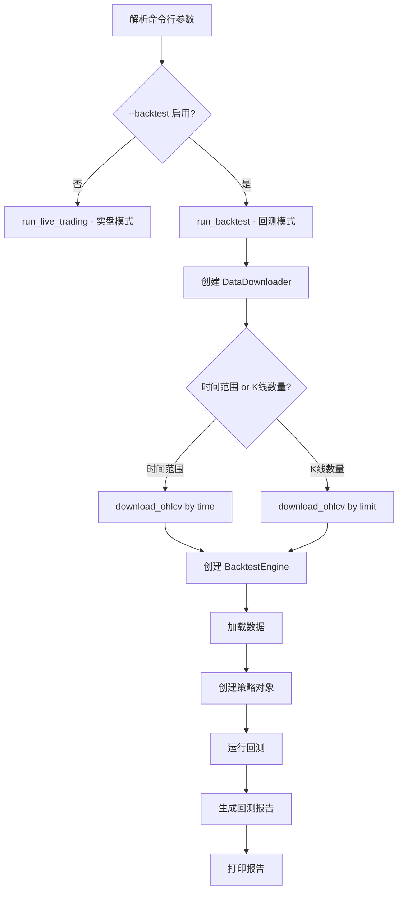

# 历史回测功能集成计划

## 概述
在现有的 `run_live_trading.py` 脚本中添加历史回测功能，支持通过命令行参数切换实盘/回测模式。

## 功能需求

### 1. 命令行参数
- `--backtest`: 启用回测模式（开关）
- `--backtest-start`: 回测开始时间（ISO格式，可选）
- `--backtest-end`: 回测结束时间（ISO格式，可选）
- `--backtest-bars`: 回测K线数量（默认1000，替代时间范围）
- `--backtest-initial-balance`: 初始资金（默认10000）
- `--backtest-slippage`: 滑点（默认0.0005，即0.05%）
- `--backtest-commission`: 手续费率（默认0.0004，即0.04%）
- `--backtest-timeframe`: K线时间周期（默认1m）

### 2. 核心功能
- 复用现有的 `BacktestEngine` 和 `BacktestReportGenerator`
- 支持 RSI Bollinger 和 DRAMM 两种策略
- 生成完整的回测报告（收益率、最大回撤、夏普比率、胜率、盈亏比等）

## 实现方案

### 文件修改
- **src/trader/scripts/run_live_trading.py**: 添加回测功能

### 新增函数
```python
def run_backtest(
    symbol: str,
    strategy_name: str,
    backtest_bars: int,
    backtest_start: Optional[str],
    backtest_end: Optional[str],
    backtest_initial_balance: int,
    backtest_slippage: float,
    backtest_commission: float,
    backtest_timeframe: str,
) -> None:
    """运行历史回测"""
```

### 流程设计



### 命令行使用示例

```bash
# 实盘模式（原有功能）
python -m src.trader.scripts.run_live_trading --strategy dramm --duration 600

# 回测模式 - 使用默认参数
python -m src.trader.scripts.run_live_trading --backtest --strategy dramm

# 回测模式 - 自定义参数
python -m src.trader.scripts.run_live_trading \
    --backtest \
    --strategy dramm \
    --backtest-bars 2000 \
    --backtest-initial-balance 10000 \
    --backtest-slippage 0.0005 \
    --backtest-commission 0.0004 \
    --symbol BTC/USDT
```

## 复用的现有组件

### 1. BacktestEngine
- 位置: `src/trader/application/backtest_engine.py`
- 功能: 回测引擎核心，订单撮合，性能计算

### 2. BacktestReportGenerator
- 位置: `src/trader/application/backtest_report.py`
- 功能: 生成完整回测报告

### 3. DataDownloader
- 位置: `src/trader/infrastructure/data_downloader.py`
- 功能: 下载历史K线数据

### 4. 策略实现
- `RSIBollingerStrategy`: `src/trader/application/strategies/crypto_classic.py`
- `DRAMMStrategy`: `src/trader/application/strategies/dramm.py`

## 实现步骤

1. 修改 `run_live_trading.py` 添加 `--backtest` 及相关参数
2. 添加 `run_backtest()` 函数
3. 在主函数中添加模式切换逻辑
4. 测试回测功能（RSIBollingerStrategy）
5. 测试回测功能（DRAMM策略）
6. 验证回测报告生成

## 预期输出

回测报告应包含：
- 初始资金、最终资金、总收益率
- 最大回撤、夏普比率、索提诺比率
- 总交易次数、胜率、盈亏比
- 利润因子、总手续费、总资金费用
