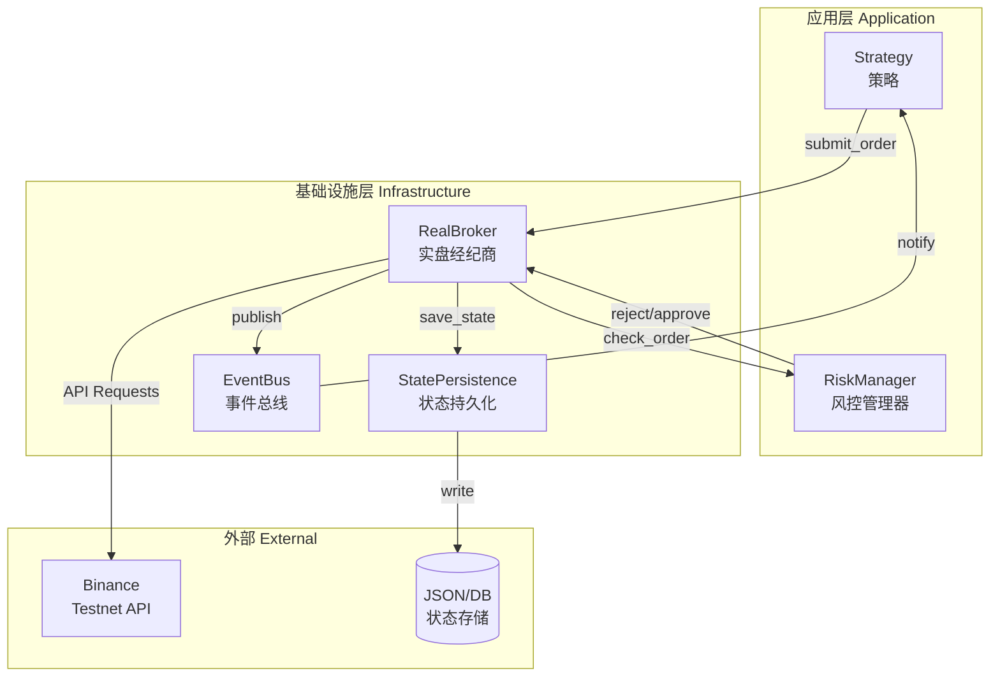

# Stage 10: 异常熔断、风控与持久化

## 任务概述

增强实盘交易系统的安全性和可靠性，包括：
1. 异常熔断与风控机制
2. 状态持久化与恢复

---

## 1. 异常熔断与风控 (Circuit Breaker & Risk Manager)

### 1.1 RiskManager 设计

**文件位置**: `src/trader/application/risk_manager.py`

**核心功能**:
- 作为装饰器/中间件，拦截所有订单提交请求
- 实现多层次风控检查

#### 风控检查清单

| 检查项 | 描述 | 阈值 | 动作 |
|--------|------|------|------|
| **Max Drawdown Protection** | 当日净值回撤 | > 5% | 强制平仓 + 停止运行 |
| **Fat Finger Check** | 单笔下单数量 | > 1 BTC | 拒绝执行 |
| **Daily Loss Limit** | 单日亏损 | > 10% | 强制平仓 + 停止 |
| **Position Size Limit** | 单标的仓位 | > 50% 净值 | 拒绝加仓 |
| **Rate Limiting** | API 请求频率 | > 100 req/min | 延迟请求 |

### 1.2 RiskManager 类结构

```python
class RiskManager:
    def __init__(self, initial_balance: Decimal, max_drawdown_pct: Decimal = Decimal("0.05")):
        self.initial_balance = initial_balance
        self.max_drawdown_pct = max_drawdown_pct
        self.peak_balance = initial_balance
        self.current_drawdown = Decimal("0")
        self.daily_pnl = Decimal("0")
        self.trading_halted = False
        
        # 风控配置
        self.max_order_size = Decimal("1")  # BTC
        self.max_position_pct = Decimal("0.5")  # 50%
        self.rate_limit_window = 60  # seconds
        self.max_requests_per_window = 100
        self.request_timestamps: List[float] = []

    def check_order(self, order: Order, current_balance: Decimal, 
                    positions: Dict[str, Position]) -> Tuple[bool, str]:
        """检查订单是否通过风控"""
        if self.trading_halted:
            return False, "Trading halted by risk manager"
        
        checks = [
            self._check_fat_finger(order),
            self._check_position_size(order, current_balance, positions),
            self._check_drawdown(current_balance),
            self._check_rate_limit(),
        ]
        
        for passed, reason in checks:
            if not passed:
                return False, reason
        
        return True, "Order approved"

    def update_balance(self, new_balance: Decimal) -> None:
        """更新余额并计算回撤"""
        if new_balance > self.peak_balance:
            self.peak_balance = new_balance
        
        self.current_drawdown = (self.peak_balance - new_balance) / self.peak_balance
        
        if self.current_drawdown >= self.max_drawdown_pct:
            self.trading_halted = True
            # 触发强制平仓信号

    def _check_fat_finger(self, order: Order) -> Tuple[bool, str]:
        if order.quantity > self.max_order_size:
            return False, f"Order size {order.quantity} exceeds max {self.max_order_size}"
        return True, ""

    def _check_position_size(self, order: Order, current_balance: Decimal,
                            positions: Dict[str, Position]) -> Tuple[bool, str]:
        # 检查新增仓位是否超过净值比例限制
        pass

    def _check_drawdown(self, current_balance: Decimal) -> Tuple[bool, str]:
        pass

    def _check_rate_limit(self) -> Tuple[bool, str]:
        pass
```

### 1.3 集成到 RealBroker

修改 `RealBroker.__init__()` 注入 RiskManager：

```python
class RealBroker:
    def __init__(self, event_bus: EventBus, env_file: str = ".env.dev", 
                 testnet: bool = True, risk_manager: Optional[RiskManager] = None):
        self.risk_manager = risk_manager or RiskManager(initial_balance=Decimal("10000"))
```

在 `submit_order()` 中添加风控检查：

```python
def submit_order(self, order: Order) -> None:
    # 风控检查
    if self.risk_manager:
        current_balance = self.get_balance()
        passed, reason = self.risk_manager.check_order(order, current_balance, self.positions)
        if not passed:
            print(f"⚠️ [RISK] 订单被拒绝: {reason}")
            order.status = OrderStatus.REJECTED
            return
    
    # 正常提交订单...
```

---

## 2. 持久化与恢复 (Persistence & Recovery)

### 2.1 设计方案

**存储格式**: JSON (简单够用，后续可升级为 SQLite)

**文件位置**: `data/trader_state.json`

**存储内容**:
- 当前持仓 (`positions`)
- 订单历史 (`orders`)
- RiskManager 状态 (`peak_balance`, `current_drawdown`, `trading_halted`)
- 余额快照

### 2.2 StatePersistence 类设计

**文件位置**: `src/trader/infrastructure/state_persistence.py`

```python
import json
from pathlib import Path
from datetime import datetime
from decimal import Decimal
from typing import Dict, Optional

from ..domain.position import Position
from ..application.order import Order


class StatePersistence:
    def __init__(self, storage_path: str = "data/trader_state.json"):
        self.storage_path = Path(storage_path)
        self.storage_path.parent.mkdir(exist_ok=True)

    def save_state(self, positions: Dict[str, Position], orders: Dict[str, Order],
                   risk_manager_state: dict, balance: Decimal) -> None:
        """保存当前状态到 JSON"""
        state = {
            "timestamp": datetime.utcnow().isoformat(),
            "balance": str(balance),
            "risk_manager": risk_manager_state,
            "positions": {
                symbol: self._position_to_dict(pos) 
                for symbol, pos in positions.items()
            },
            "orders": {
                order_id: self._order_to_dict(order)
                for order_id, order in orders.items()
            }
        }
        
        with open(self.storage_path, "w", encoding="utf-8") as f:
            json.dump(state, f, indent=2, ensure_ascii=False)
        
        print(f"💾 [PERSIST] 状态已保存: {self.storage_path}")

    def load_state(self) -> Optional[dict]:
        """从 JSON 加载状态"""
        if not self.storage_path.exists():
            return None
        
        with open(self.storage_path, "r", encoding="utf-8") as f:
            state = json.load(f)
        
        print(f"📂 [PERSIST] 状态已加载: {self.storage_path}")
        return state

    def _position_to_dict(self, position: Position) -> dict:
        """Position 转换为可序列化字典"""
        return {
            "symbol": position.symbol,
            "side": position.side.value,
            "quantity": str(position.quantity),
            "entry_price": str(position.entry_price),
            "leverage": position.leverage,
            # ... 其他必要字段
        }

    def _order_to_dict(self, order: Order) -> dict:
        """Order 转换为可序列化字典"""
        return {
            "id": order.id,
            "symbol": order.symbol,
            "side": order.side,
            "order_type": order.order_type,
            "quantity": str(order.quantity),
            "price": str(order.price) if order.price else None,
            "status": order.status.value,
            "timestamp": order.timestamp.isoformat() if order.timestamp else None,
        }
```

### 2.3 集成到 RealBroker

修改 `RealBroker` 添加持久化支持：

```python
class RealBroker:
    def __init__(self, ..., state_persistence: Optional[StatePersistence] = None):
        self.state_persistence = state_persistence or StatePersistence()
        
        # 尝试恢复状态
        self._try_restore_state()

    def _try_restore_state(self) -> None:
        """尝试从持久化恢复状态"""
        state = self.state_persistence.load_state()
        if state:
            # 恢复持仓、订单等...
            pass

    def _save_state_periodically(self) -> None:
        """定期保存状态（可在后台线程调用）"""
        balance = self.get_balance()
        risk_state = {
            "peak_balance": str(self.risk_manager.peak_balance),
            "current_drawdown": str(self.risk_manager.current_drawdown),
            "trading_halted": self.risk_manager.trading_halted,
        }
        self.state_persistence.save_state(self.positions, self.orders, risk_state, balance)
```

---

## 3. 更新 run_live_trading.py

集成 RiskManager 和 StatePersistence 到实盘入口脚本：

```python
def run_live_trading():
    # ... 初始化组件 ...
    
    # 初始化风控管理器
    risk_manager = RiskManager(
        initial_balance=Decimal(str(args.initial_balance)),
        max_drawdown_pct=Decimal("0.05")
    )
    
    # 初始化状态持久化
    state_persistence = StatePersistence()
    
    # 创建 RealBroker（注入风控和持久化）
    real_broker = RealBroker(
        event_bus=event_bus,
        env_file=".env.dev",
        testnet=True,
        risk_manager=risk_manager,
        state_persistence=state_persistence
    )
    
    # ... 其余代码 ...
    
    # 主循环中定期保存状态
    try:
        while True:
            # ... 处理数据 ...
            
            # 每 N 次迭代保存一次状态
            if iteration % 10 == 0:
                real_broker._save_state_periodically()
                
    finally:
        # 退出前保存最终状态
        real_broker._save_state_periodically()
```

---

## 4. 实现步骤

| 步骤 | 任务 | 文件 |
|------|------|------|
| 1 | 创建 RiskManager 类 | `src/trader/application/risk_manager.py` |
| 2 | 创建 StatePersistence 类 | `src/trader/infrastructure/state_persistence.py` |
| 3 | 集成 RiskManager 到 RealBroker | `src/trader/infrastructure/real_broker.py` |
| 4 | 集成 StatePersistence 到 RealBroker | `src/trader/infrastructure/real_broker.py` |
| 5 | 更新 run_live_trading.py | `src/trader/scripts/run_live_trading.py` |
| 6 | 创建风控测试脚本 | `test_risk_manager.py` |
| 7 | 创建持久化测试脚本 | `test_state_persistence.py` |
| 8 | 更新 tasks.md | `tasks.md` |

---

## 5. Mermaid 架构图



---

## 6. 验收标准

- [ ] RiskManager 能正确拦截 Fat Finger 订单
- [ ] Max Drawdown 超过阈值时能触发熔断
- [ ] 状态能正确保存到 JSON 文件
- [ ] 启动时能从 JSON 恢复状态
- [ ] 集成后 run_live_trading.py 能正常运行
- [ ] 所有单元测试通过

