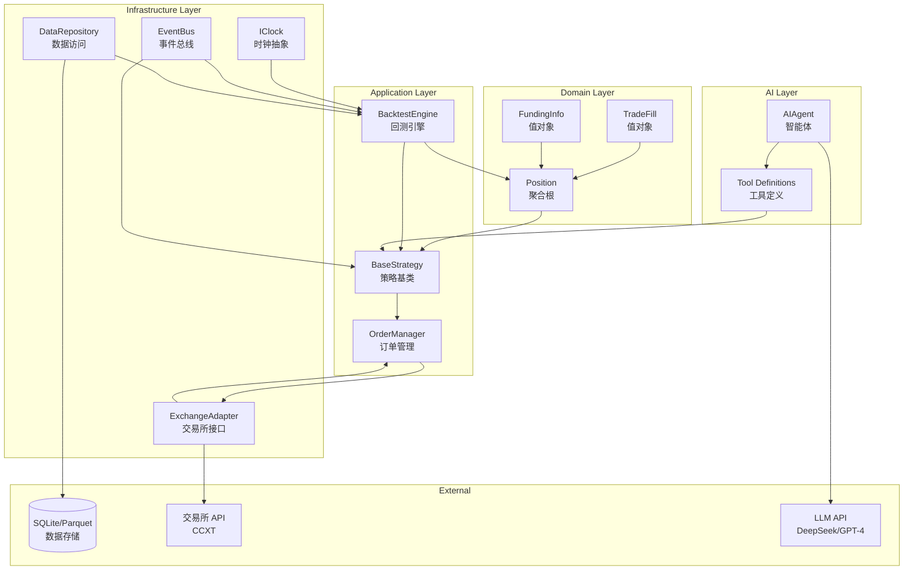

## 📋 技术实现路径评估报告

### 一、系统架构分析

| 层级 | 模块 | 职责 | 关键类 |
|------|------|------|--------|
| **领域层** | 核心领域模型 | 封装业务逻辑，确保数据一致性 | [`Position`](domain/models.py:51), [`TradeFill`](domain/models.py:39), [`FundingInfo`](domain/models.py:32) |
| **基础设施层** | 时钟抽象 | 统一回测与实盘时间处理 | [`IClock`](infrastructure/clock.py:109), [`BacktestClock`](infrastructure/clock.py:117), [`RealtimeClock`](infrastructure/clock.py:113) |
| **基础设施层** | 事件总线 | 解耦组件间通信 | [`EventBus`](infrastructure/events.py), [`MarketEvent`](infrastructure/events.py) |
| **基础设施层** | 数据访问 | OHLCV 与资金费率数据存取 | [`DataRepository`](infrastructure/data.py) |
| **应用层** | 回测引擎 | 高保真回测核心 | [`BacktestEngine`](application/backtest.py) |
| **应用层** | 策略框架 | 策略开发基础 | [`BaseStrategy`](application/strategy.py) |
| **应用层** | 订单管理 | 订单生命周期管理 | [`OrderManager`](application/orders.py) |
| **AI 层** | LLM 集成 | AI 信号生成与参数调整 | [`AIAgent`](ai/agent.py), Tool Definitions |

---

### 二、技术选型评估

| 组件 | 技术选型 | 理由 | 潜在风险 |
|------|----------|------|----------|
| **类型系统** | Pydantic v2 | 强类型、JSON 序列化、验证 | 性能开销 |
| **数值计算** | Decimal | 精确金融计算，避免浮点误差 | 操作性能略低于 float |
| **交易所接口** | CCXT | 统一 API，支持 100+ 交易所 | 不同交易所实现差异 |
| **数据存储** | SQLite / Parquet | 轻量级，本地开发友好 | 大数据量性能 |
| **指标计算** | pandas + TA-Lib | 成熟技术方案 | TA-Lib Windows 安装问题 |
| **LLM 集成** | OpenAI 兼容 API | DeepSeek/GPT-4 统一接口 | API 成本、延迟 |

---

### 三、性能指标与验收标准

| 指标类别 | 指标 | 目标值 | 验收方法 |
|----------|------|--------|----------|
| **回测性能** | 1年15分钟K线处理 | < 30秒 | Benchmark 测试 |
| **回测性能** | 内存占用 | < 2GB | 内存分析 |
| **实盘性能** | 订单延迟 | < 500ms | 端到端测试 |
| **实盘性能** | 市场数据延迟 | < 100ms | WebSocket 测试 |
| **计算精度** | 盈亏计算误差 | < 0.01% | 单元测试 |
| **AI 集成** | Function Calling 成功率 | > 95% | 集成测试 |
| **系统可靠性** | 可用性 | > 99.9% | 监控统计 |
| **测试覆盖** | 领域模型覆盖率 | > 90% | Coverage Report |

---

### 四、潜在风险与应对策略

| 风险类别 | 风险描述 | 影响程度 | 应对策略 |
|----------|----------|----------|----------|
| **数据一致性** | 回测与实盘数据结构不一致导致策略表现偏差 | 🔴 高 | 共享领域模型，Pydantic 强类型约束 |
| **资金费率** | 忽略费率导致回测虚高收益 | 🔴 高 | 回测引擎强制模拟费率结算 |
| **AI 安全** | LLM 直接下单造成不可控损失 | 🔴 高 | 混合架构：AI 只调整参数，不直接下单 |
| **滑点模拟** | 固定滑点无法反映真实损耗 | 🟡 中 | 基于波动率的动态滑点模型 |
| **时区处理** | 时间戳格式不一致导致逻辑错误 | 🟡 中 | 统一 UTC 时间，IClock 抽象 |
| **精度累积** | 浮点数计算误差累积 | 🟡 中 | 全程 Decimal 类型 |
| **API 限流** | 交易所 API 频率限制 | 🟡 中 | 请求队列 + 限流器 |
| **网络中断** | 实盘网络不稳定 | 🟡 中 | 本地状态缓存 + 断线重连 |

---

### 五、项目任务清单

## 阶段 1：环境与基础设施搭建 ✅

### 1.1 项目结构初始化
- [x] 创建 DDD 标准项目目录结构
  - [x] `src/trader/domain/` - 领域层
  - [x] `src/trader/infrastructure/` - 基础设施层
  - [x] `src/trader/application/` - 应用层
  - [x] `src/trader/ai/` - AI 集成层
  - [x] `src/trader/utils/` - 工具层
  - [x] `tests/` - 测试目录
  - [ ] `data/` - 数据目录

### 1.2 依赖配置
- [x] 使用 uv 管理 Python 包
- [x] 创建 `pyproject.toml` 配置文件
- [x] 安装核心依赖
  - [x] pydantic v2
  - [x] ccxt
  - [x] pandas
  - [x] numpy
  - [ ] TA-Lib (或 pandas-ta 作为替代)
  - [ ] openai (兼容 DeepSeek)
  - [x] pytest (测试框架)
  - [ ] pytest-cov (覆盖率)

### 1.3 开发环境验证
- [x] 配置 Git (`.gitignore`, pre-commit hooks)
- [ ] 配置 VS Code (settings.json, extensions.json)
- [x] 验证 uv 环境正常工作
- [x] 运行 pytest 验证测试框架

---

## 阶段 2：领域模型层实现 ✅

### 2.1 值对象定义
- [x] 创建 `domain/value_objects.py`
  - [x] `Side` 枚举 (LONG, SHORT)
  - [x] `OrderType` 枚举 (MARKET, LIMIT)
  - [x] `FundingInfo` - 资金费率数据
  - [x] `TradeFill` - 成交明细（不可变）

### 2.2 Position 聚合根实现
- [x] 创建 `domain/position.py`
  - [x] 基础属性定义
  - [x] `increase()` 方法 - 加仓逻辑
  - [x] `decrease()` 方法 - 减仓/平仓逻辑，返回已结盈亏
  - [x] `calculate_unrealized_pnl()` - 计算未结盈亏
  - [x] `update_liquidation_price()` - 更新清算价格
  - [x] `calculate_maintenance_margin()` - 计算维持保证金

### 2.3 领域服务
- [x] 创建 `domain/services.py`
  - [x] `PositionFactory` - 仓位工厂方法
  - [x] `MarginCalculator` - 保证金计算服务

### 2.4 领域模型单元测试
- [x] 测试加仓平均价格计算
- [x] 测试平仓盈亏计算
- [x] 测试清算价格计算
- [x] 测试维持保证金计算
- [x] 测试边界条件（零仓位、最大杠杆等）

---

## 阶段 3：基础设施层实现 ✅

### 3.1 时钟抽象层
- [x] 创建 `infrastructure/clock.py`
  - [x] `IClock` 抽象基类
  - [x] `RealtimeClock` - 返回 UTC 当前时间
  - [x] `BacktestClock` - 可控制的回测时钟
  - [x] 单元测试

### 3.2 事件总线
- [x] 创建 `infrastructure/event_bus.py`
  - [x] `MarketEvent` - K线/资金费率事件
  - [x] `OrderEvent` - 订单事件
  - [x] `PositionEvent` - 仓位变更事件
  - [x] `EventBus` - 事件发布订阅
  - [x] 单元测试

### 3.3 数据访问层
- [x] 创建 `infrastructure/data_repository.py`
  - [x] `IDataRepository` 接口
  - [x] `InMemoryDataRepository` - 内存实现
  - [ ] `SQLiteRepository` - SQLite 实现
  - [ ] `ParquetRepository` - Parquet 实现（可选）
  - [x] 数据格式定义

### 3.4 CCXT 适配器
- [x] 创建 `infrastructure/data_downloader.py`
  - [x] `DataDownloader` - CCXT 数据下载器
  - [x] 支持 OHLCV 下载
  - [x] 支持资金费率下载
  - [ ] `ExchangeAdapter` - 统一交易所接口
  - [ ] `BinanceFutureAdapter` - 币安永续合约适配器
  - [ ] 订单执行适配
  - [ ] 仓位查询适配
  - [ ] Mock 适配器用于测试

---

## 阶段 4：应用层核心功能 ✅

### 4.1 策略基类
- [x] 创建 `application/strategy.py`
  - [x] `BaseStrategy` 抽象基类
  - [x] `on_bar()` - K线回调
  - [ ] `on_funding_rate()` - 资金费率回调
  - [ ] `on_order_update()` - 订单更新回调
  - [ ] `generate_signals()` - 信号生成接口

### 4.2 订单管理器
- [x] 创建 `application/order.py`
  - [x] `Order` 模型
  - [x] `OrderStatus` 枚举
- [x] 订单管理在 `SimulatedBroker` 中实现
  - [x] `submit_order()` - 提交订单
  - [x] `cancel_order()` - 取消订单
  - [x] `get_open_orders()` - 获取未结订单
  - [x] 订单状态机维护

### 4.3 回测引擎
- [x] 创建 `application/backtest_engine.py`
  - [x] `BacktestEngine` - 主引擎
  - [x] `run()` - 执行回测
  - [x] 日志记录
  - [x] 绩效统计

---

## 阶段 5：MVP 策略回测 ✅

### 5.1 资金费率模拟
- [x] 实现资金费率数据下载
  - [x] CCXT 获取历史资金费率
  - [x] 存储为标准格式
- [x] 回测引擎集成资金费率
  - [x] 费率结算时点检测 (00:00, 08:00, 16:00 UTC)
  - [x] 多头/空头费率计算
  - [x] 累计费率统计

### 5.2 波动率滑点模型
- [x] 创建 `utils/slippage.py`
  - [x] `VolatilitySlippageModel` - 基于ATR的滑点
  - [x] `calculate_slippage()` - 动态滑点计算
- [x] 回测引擎集成滑点（固定滑点已实现）

### 5.3 清算价格计算
- [x] 实现精确清算价格公式
- [x] 测试极端市场条件下的清算
- [x] 回测引擎监控清算事件

### 5.4 模拟撮合
- [x] 实现限价单撮合逻辑
  - [x] 基于 K线高低价判断
  - [x] 部分成交处理
- [x] 实现市价单撮合逻辑
  - [x] 一对一成交
  - [x] 滑点应用

---

## 阶段 6：MVP 策略实现 ✅

### 6.1 指标计算工具
- [x] 创建 `utils/indicators.py`
  - [x] `calculate_sma()` - 简单移动平均
  - [x] `calculate_ema()` - 指数移动平均
  - [x] `calculate_rsi()` - 相对强弱指标
  - [x] `calculate_atr()` - 真实波幅
- [x] 简单 SMA 实现在策略中

### 6.2 双均线 + 资金费率策略
- [x] 创建 `strategies/ma_crossover.py`
  - [x] 快速均线参数 (默认 10)
  - [x] 慢速均线参数 (默认 20)
  - [x] 资金费率过滤逻辑
  - [x] 信号生成
  - [x] 止损止盈设置

### 6.3 数据下载脚本
- [x] 创建 `scripts/download_data.py`
- [x] 数据下载功能在 `infrastructure/data_downloader.py` 中实现
  - [x] 下载 BTC/USDT 15分钟K线
  - [x] 下载资金费率数据
  - [x] 数据清洗与验证
  - [x] 存储到 SQLite/Parquet

### 6.4 回测验证
- [x] 运行双均线策略回测
- [x] 生成回测报告
  - [x] 总盈亏
  - [x] 夏普比率
  - [x] 最大回撤
  - [x] 资金费率影响分析
- [x] 对比有/无资金费率的结果

---

## 阶段 7：AI 集成层（第二阶段） ✅

### 7.1 LLM API 适配器
- [x] 创建 `ai/llm_client.py`
  - [x] `LLMClient` - 统一 LLM 接口
  - [x] 支持 DeepSeek API
  - [x] 支持 OpenAI API
  - [x] 请求重试与错误处理

### 7.2 Tool Definitions
- [x] 创建 `ai/tools.py`
  - [x] `get_market_state()` - 获取市场状态
  - [x] `adjust_strategy_params()` - 调整策略参数
  - [x] JSON Schema 定义
  - [x] 工具执行器

### 7.3 Reflexion Loop
- [x] 创建 `ai/agent.py`
  - [x] `AIAgent` - 智能体主类
  - [x] `observe()` - 观察阶段
- [x] 创建 `ai/reflexion.py`
  - [x] `reason()` - 思考阶段
  - [x] `act()` - 行动阶段
  - [x] `execute()` - 执行阶段
  - [x] 定时触发机制

### 7.4 参数调整服务
- [x] 创建 `application/parameter_tuner.py`
- [x] 策略参数模型在 `ai/strategy_params.py` 中实现
  - [x] 接收 AI 参数调整建议
  - [x] 安全验证（参数范围检查）
  - [x] 应用新参数到运行策略

---

## 开发里程碑

| 里程碑 | 目标 | 预估时间 |
|--------|------|----------|
| M1 | 环境搭建完成 | Day 1 |
| M2 | 领域模型实现并通过测试 | Day 2-3 |
| M3 | 基础设施层完成 | Day 4-5 |
| M4 | 回测引擎核心功能完成 | Day 6-7 |
| M5 | MVP 策略回测成功 | Day 8-9 |
| M6 | AI 集成层完成 | Day 10-12 |
| M7 | 测试验收通过 | Day 13-14 |

---

## Mermaid 架构图

---

## Stage 9: 策略扩充与实盘模拟 (Paper Trading) ✅

### 9.1 指标库升级 ✅
- [x] 完善 `src/trader/utils/indicators.py`
  - [x] `calculate_bollinger_bands()` - 布林带（支持增量更新）
  - [x] `calculate_macd()` - MACD（支持增量更新）
  - [x] `calculate_kdj()` - KDJ（支持增量更新）
  - [x] **技术方案**：采用方案 A - 每次新 Bar 进来，把历史 Window（过去 100 根）拼上新 Bar，重算一次
- [x] 为新指标编写单元测试
  - [x] 验证流式计算与批量计算结果一致（test_streaming_consistency.py）
  - [x] 边界条件测试

### 9.2 实现"研报级"新策略 ✅
- [x] 创建 `src/trader/application/strategies/crypto_classic.py`
  - [x] **RSI_Bollinger_Strategy** - 结合趋势与反转的复合策略
    - [x] 布林带开口判断趋势
    - [x] RSI 超买超卖判断反转
    - [x] 信号生成逻辑
  - [x] **Funding_Arbitrage_Strategy** - 资金费率套利观察策略（MVP 单腿观察者）
    - [x] 利用 `on_funding_rate` 回调
    - [x] 检测套利机会并输出日志
    - [x] 只计算潜在收益，不下单（避开多标的复杂度）
- [x] 策略回测验证（使用真实币安数据）
  - [x] RSI+Bollinger 策略：-0.82% 收益，37 笔交易
  - [x] Funding Arbitrage 策略：检测到 30 个机会，3 个显著机会

### 9.3 实盘模拟环境 (Paper Trading Mode) ✅
- [x] 实现 `PaperBroker`
  - [x] 监听实时行情数据
  - [x] 模拟真实挂单撮合（核心逻辑）
    - [x] 订阅实时 Ticker/OrderBook 数据
    - [x] 市价单：按当前实时 Ticker 价格成交
    - [x] 限价单：挂在本地 pending_orders，实时行情 high/low 触发成交
  - [x] 创建 `run_paper_trading.py` 脚本
  - [x] 修复 Total Return: 0.00% 问题
  - [x] 实现实时 ticker 数据获取
  - [x] 修复 ACCOUNT 权益不更新问题
  - [x] 修复 Bid/Ask 显示问题

### 9.4 接入币安真实模拟盘（Testnet）✅
- [x] 配置币安 Testnet API 密钥
- [x] 实现 `RealBroker`
  - [x] 连接币安 Testnet
  - [x] 提交订单
  - [x] 取消订单
  - [x] 获取账户余额
  - [x] 获取账户摘要
- [x] 测试真实模拟盘连接
  - [x] 成功连接币安 Testnet
  - [x] 获取到账户余额 $10,000.00

### 9.5 长期稳定性测试（可选）
- [ ] 云服务器部署
- [ ] Ubuntu/Linux 环境
- [ ] Docker 容器化运行
- [ ] 稳定性测试
- [ ] 连续运行 24/48 小时
- [ ] 监控内存泄漏
- [ ] 监控 CCXT 连接稳定性

### 9.6 RealBroker 订单同步机制与实盘入口 ✅
- [x] 增强 RealBroker - 添加线程安全锁和增量处理数据结构
 - [x] 添加 `self._lock = threading.Lock()` 用于线程安全
 - [x] 添加 `self._last_filled_quantity: Dict[str, Decimal]` 记录每个订单上次同步的成交量
- [x] 新增订单同步方法
 - [x] `sync_open_orders()` - 同步所有未结订单
 - [x] `_sync_single_order(exchange_order_id: str)` - 同步单个订单
 - [x] `_handle_order_partial_fill()` - 处理部分成交
 - [x] `_handle_order_fill_delta()` - 处理增量成交
 - [x] `start_order_sync(interval: int = 5)` - 启动后台轮询
 - [x] `stop_order_sync()` - 停止后台轮询
- [x] 创建实盘入口脚本 `src/trader/scripts/run_live_trading.py`
 - [x] 基于 run_real_trading.py 结构
 - [x] 使用 RealBroker 替代 PaperBroker
 - [x] 集成订单同步机制（启动/停止）
 - [x] 完整的实盘交易流程
- [x] 修改现有方法使用 lock 保护共享数据
 - [x] submit_order() - 提交订单
 - [x] _handle_order_fill() - 处理成交
 - [x] cancel_order() - 取消订单
 - [x] get_position()、get_balance()、get_market_price()、get_account_summary()

---

## Stage 10: 异常熔断、风控与持久化实现 ✅

### 10.1 风控管理器 (RiskManager) ✅
* [x] 创建 `src/trader/application/risk_manager.py`
 * [x] **Max Drawdown Protection** - 当日净值回撤 > 5% 强制平仓并停止运行
 * [x] **Fat Finger Check** - 单笔下单数量 > 1 BTC 拒绝执行
 * [x] **Daily Loss Limit** - 单日亏损 > 10% 强制停止
 * [x] **Position Size Limit** - 单标的仓位 > 50% 净值拒绝加仓
 * [x] **Rate Limiting** - API 请求频率 > 100 req/min 延迟处理
 * [x] `check_order()` - 风控检查主方法，返回 (bool, str)
 * [x] `update_balance()` - 更新余额并计算回撤
 * [x] `get_state()` / `restore_state()` - 状态持久化支持
 * [x] 线程安全（使用 threading.Lock 保护）
* [x] 创建 `test_risk_manager.py` 单元测试

### 10.2 状态持久化 (StatePersistence) ✅
* [x] 创建 `src/trader/infrastructure/state_persistence.py`
 * [x] JSON 格式存储到 `data/trader_state.json`
 * [x] `save_state()` - 保存持仓、订单、风控状态、余额
 * [x] `load_state()` - 从文件加载状态
 * [x] `restore_positions()` / `restore_orders()` - 反序列化
 * [x] `_position_to_dict()` / `_order_to_dict()` - 序列化
* [x] 创建 `test_state_persistence.py` 单元测试

### 10.3 RealBroker 集成 ✅
* [x] 增强 `src/trader/infrastructure/real_broker.py`
 * [x] 注入 RiskManager 和 StatePersistence
 * [x] `submit_order()` 前先进行风控检查
 * [x] `_try_restore_state()` - 启动时恢复
 * [x] `_save_state_periodically()` - 定期保存
 * [x] 保持线程安全

### 10.4 更新实盘入口脚本 ✅
* [x] 更新 `src/trader/scripts/run_live_trading.py`
 * [x] 初始化 RiskManager 和 StatePersistence
 * [x] 注入到 RealBroker
 * [x] 主循环定期保存状态（每 10 次迭代）
 * [x] 退出前保存最终状态
 * [x] 添加 `--initial-balance` 命令行参数

### 10.5 测试验证
* [x] 风控单元测试 (`test_risk_manager.py`)
* [x] 持久化单元测试 (`test_state_persistence.py`)